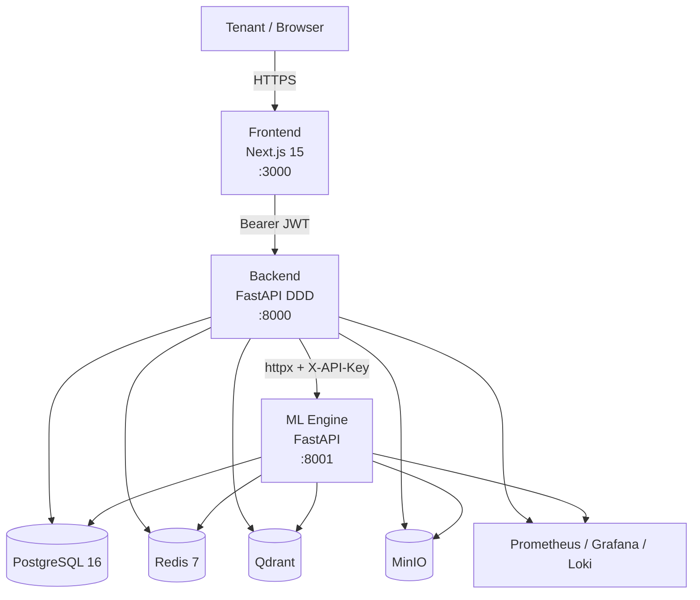
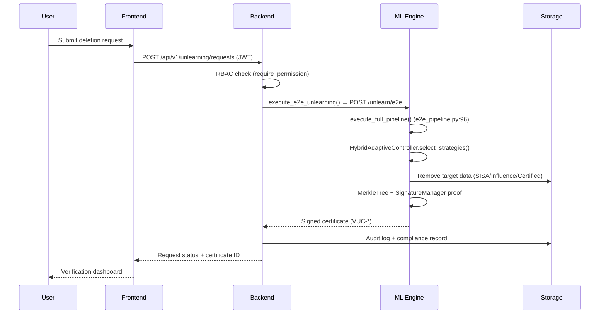
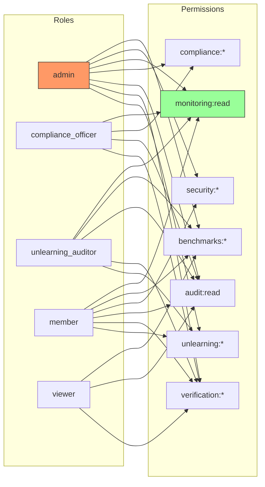
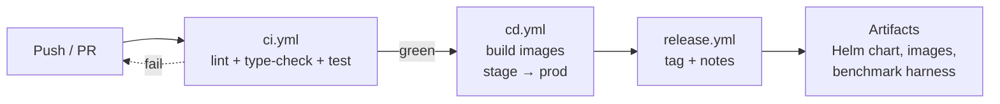

# VeriUnlearn — Architecture

System architecture for VeriUnlearn v1.0 RC. Diagrams use Mermaid.

---

## (a) High-Level System Context

The **Backend is the only component permitted to call the ML Engine**
(`MLEngineClient`, `packages/backend/app/infrastructure/external/ml_engine.py`).
Frontend talks only to the Backend.

---

## (b) Unlearning + Verification Request Flow

---

## (c) RBAC Permission Model

Source: `packages/backend/app/core/rbac.py` (`Permission` enum + `ROLE_PERMISSIONS`).
`MONITORING_READ` added in RC (`rbac.py:37`).

---

## (d) CI/CD Pipeline

Workflows: `.github/workflows/{ci,cd,release}.yml`. Images deployed via
`infra/kubernetes/helm/veriunlearn/` (staging + production overlays).

---

_See also: `docs/adr/ADR-0001-architecture.md`, `artifacts/SECURITY_AUDIT.md`,
`artifacts/DEPLOYMENT_CHECKLIST.md`._
