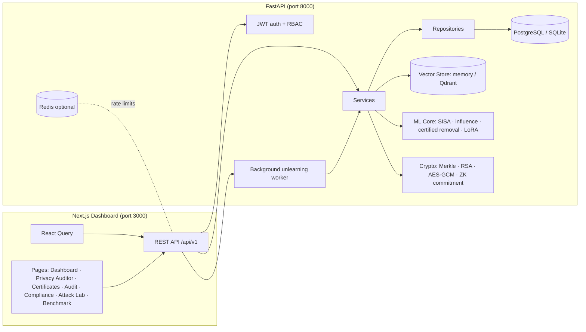
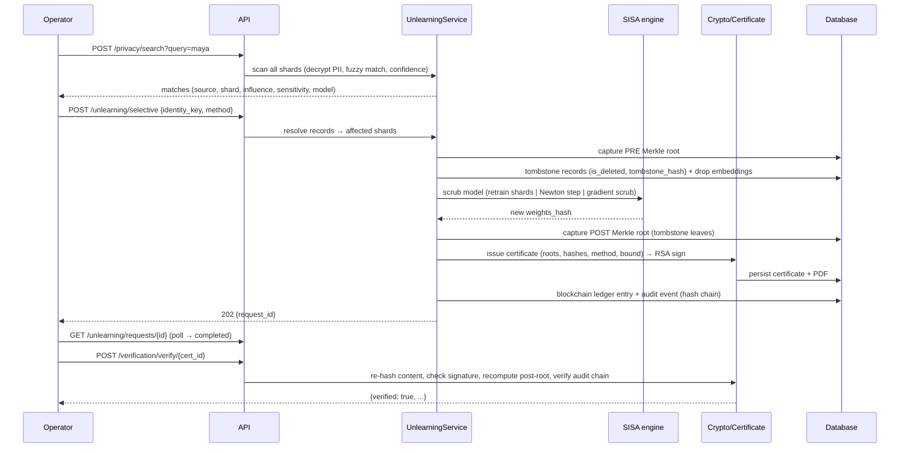
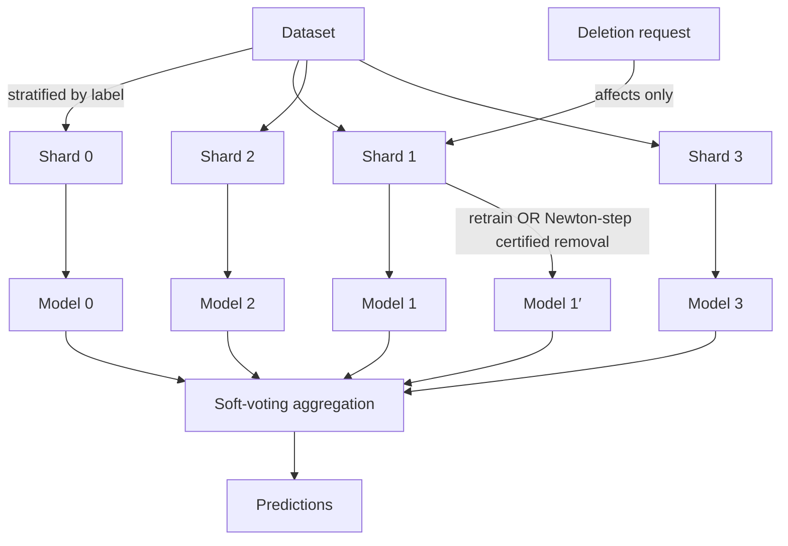
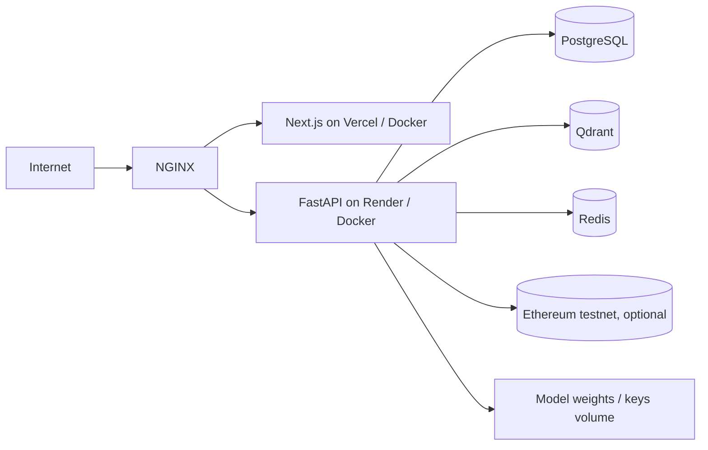

# VeriUnlearn — Architecture

## 1. Design principles

- **Clean architecture, dependency inversion** — API → services → repositories → models. Services
  depend on interfaces (e.g. `UnlearnableModel`, `VectorStore`), never on transports.
- **One transaction per request** — async SQLAlchemy sessions commit on success, roll back on error.
- **Append-only, never destructive** — deleted records are *tombstoned* (flagged + tombstone hash),
  never hard-deleted, so certificates stay verifiable forever.
- **Deterministic hashing** — canonical JSON + sorted Merkle leaves make every root reproducible.
- **Config-driven infrastructure** — SQLite/in-memory by default; PostgreSQL/Redis/Qdrant via env.

## 2. Component diagram



## 3. The unlearning pipeline (sequence)



## 4. SISA + certified removal



- **SISA retrain** — gold standard: re-train only affected shard(s) on remaining data.
- **Certified removal** — for convex models, `w' = w − H⁻¹ ∇L(z_removed)` with the *exact* Hessian
  of the averaged regularised logistic loss. The certificate stores the bound
  `|f_{w'}(x) − f_w(x)| ≤ ‖w'−w‖₂ · max_x‖x‖₂` for every input `x`.

## 5. Merkle deletion proofs

```mermaid
flowchart LR
    R1[record 1] --> H1[leaf = SHA256(record_id, content_hash)]
    R2[record 2] --> H2[leaf]
    R3[record 3] --> H3[tombstone leaf after deletion]
    R4[record 4] --> H4[leaf]
    H1 & H2 --> P1[parent]
    H3 & H4 --> P2[parent]
    P1 & P2 --> ROOT[Pre/Post Merkle Root]
    ROOT --> CERT[RSA-signed certificate]
```

Leaves are sorted; deleting a record swaps its leaf for a deterministic tombstone
(`SHA256(record_id, content_hash, deleted)`) so the root provably changes and can be recomputed
from the live database during verification.

## 6. Data model (ER)

```mermaid
erDiagram
    USERS ||--o{ DELETION_REQUESTS : requests
    DATASETS ||--o{ DATASET_RECORDS : contains
    DATASETS ||--o{ ML_MODELS : trains
    ML_MODELS ||--o{ MODEL_SHARDS : owns
    DELETION_REQUESTS ||--o| CERTIFICATES : produces
    CERTIFICATES ||--o| AUDIT_EVENTS : anchored
    CERTIFICATES ||--o| BLOCKCHAIN_LEDGER : mirrored

    DATASETS { string id PK; string name; int shard_count; json feature_names }
    DATASET_RECORDS { string id PK; string dataset_id FK; int shard_id; json features; string content_hash; bool is_deleted; string tombstone_hash; string identity_key; string full_name_enc; float influence_score }
    ML_MODELS { string id PK; string dataset_id FK; int version; string weights_hash; json metrics }
    MODEL_SHARDS { string id PK; string model_id FK; int shard_index; string weights_path; string weights_hash; int record_version }
    DELETION_REQUESTS { string id PK; string identity_key; string method; string status; json record_ids; json shard_ids }
    CERTIFICATES { string id PK; string dataset_id; string pre_merkle_root; string post_merkle_root; string signature; json zk_proof }
    AUDIT_EVENTS { string id PK; string event_type; string prev_hash; string event_hash; json payload }
    BLOCKCHAIN_LEDGER { string id PK; string certificate_id FK; string cert_hash; string tx_hash }
```

## 7. Deployment topology



See [`deployment.md`](deployment.md) for environment variables and platform-specific steps.

## 8. Security model

| Layer | Mechanism |
|---|---|
| Authentication | JWT (HS256) with role claims; bcrypt password hashes |
| Authorization | RBAC: `admin`, `operator`, `auditor` (FastAPI dependency) |
| PII at rest | AES-256-GCM (key from HKDF of `SECRET_KEY`); identities decrypted only in memory |
| Integrity | SHA-256 content hashes, canonical JSON, sorted Merkle leaves |
| Non-repudiation | RSA-PKCS1v15 signatures over canonical certificate bodies |
| Audit | Hash-chained events; recomputation detects any tampering |
| Abuse | slowapi rate limiting, CORS allowlist, input validation, secure upload size caps |
