# VeriUnlearn — Diagrams

Editable diagram sources (Mermaid). Render on GitHub by viewing this file, on
[mermaid.live](https://mermaid.live), or via `npx @mermaid-js/mermaid-cli mmdc -i docs/diagrams.md -o out.svg`.
Each diagram is a self-contained fenced block — copy a block into mermaid.live to export
PNG/SVG for reports and presentations.

---

## 1. High-Level System Architecture

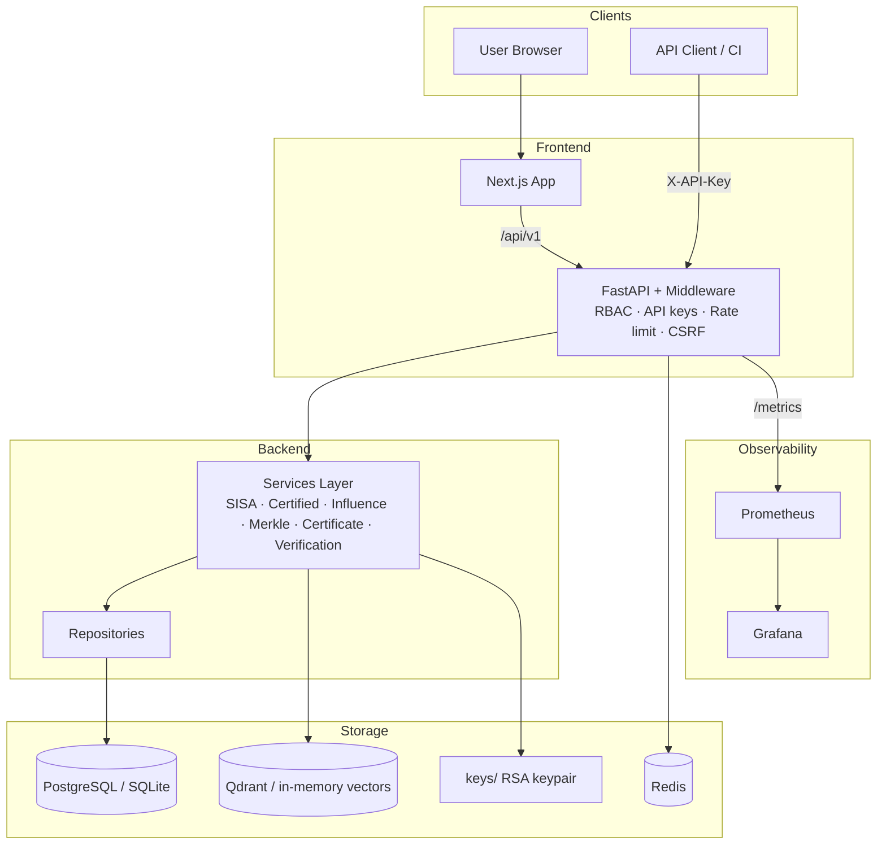

## 2. Low-Level Architecture (Module View)

```mermaid
flowchart LR
    subgraph api
        A1[auth] A2[datasets] A3[models] A4[privacy] A5[unlearning]
        A6[verification] A7[certificates] A8[compliance] A9[research]
        A10[admin] A11[apikeys] A12[notifications] A13[monitoring] A14[analytics]
    end
    subgraph services
        S1[crypto/sisa/certified/influence] S2[merkle/certificate/verification_engine/zkproof]
        S3[pii_detection/privacy] S4[benchmark_engine/attacks/experiments/research_metrics]
        S5[admin/api_keys/notifications/monitoring/analytics/compliance]
    end
    subgraph repositories
        R1[user/dataset/model/deletion] R2[privacy/verification/research] R3[audit]
    end
    subgraph core
        C1[config/security/rbac/middleware/logging/exceptions]
    end
    api --> services --> repositories
    api --> core
    services --> core
```

## 3. ER Diagram (core entities)

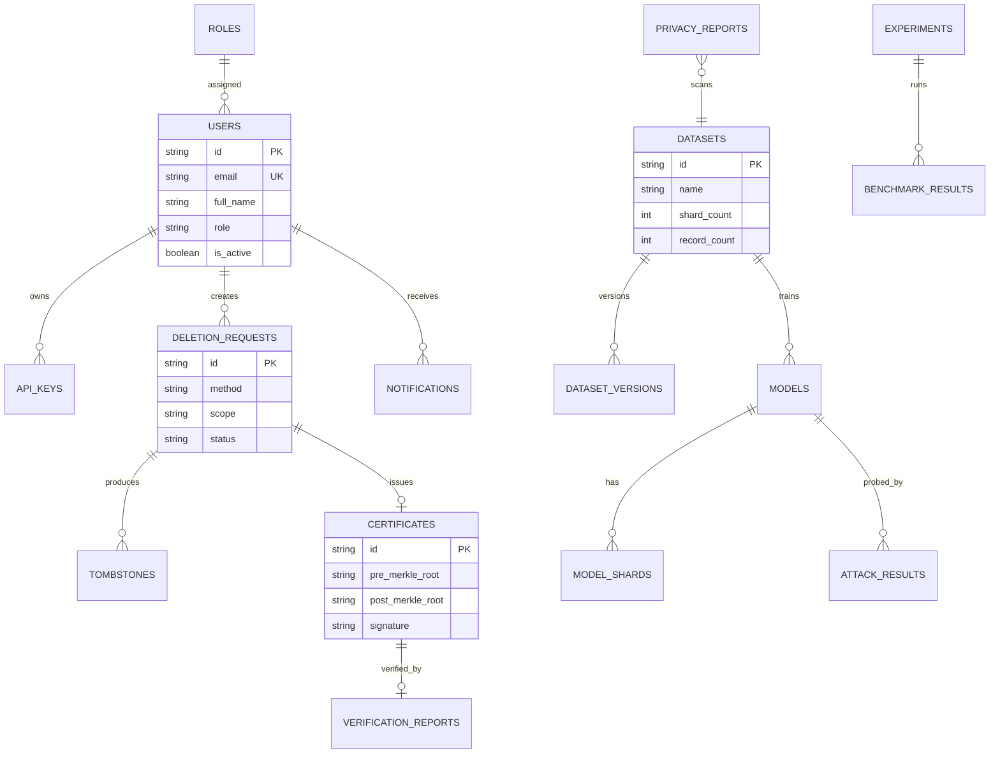

## 4. Database Schema (Phase 7 tables added)

```mermaid
flowchart TB
    subgraph Phase7_Tables
        R[roles] --> U2[users.role]
        P[permissions]
        AK[api_keys] --> U2
        N[notifications] --> U2
        SM[system_metrics]
        CR[compliance_reports]
        DL[deployment_logs]
        AC[analytics_cache]
    end
    subgraph Phases1_6
        U[users] DT[datasets] M[models] MS[model_shards] DR[deletion_requests]
        TB[tombstones] CERT[certificates] VR[verification_reports] AE[audit_events]
        BR[benchmark_results] AR[attack_results] EXP[experiments] PM[performance_metrics]
        PR[privacy_reports] SH[search_history]
    end
```

## 5. DFD Level 0 (Context)

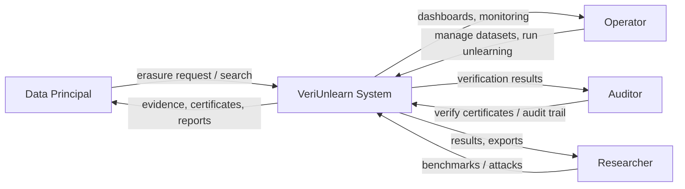

## 6. DFD Level 1 (Main processes)

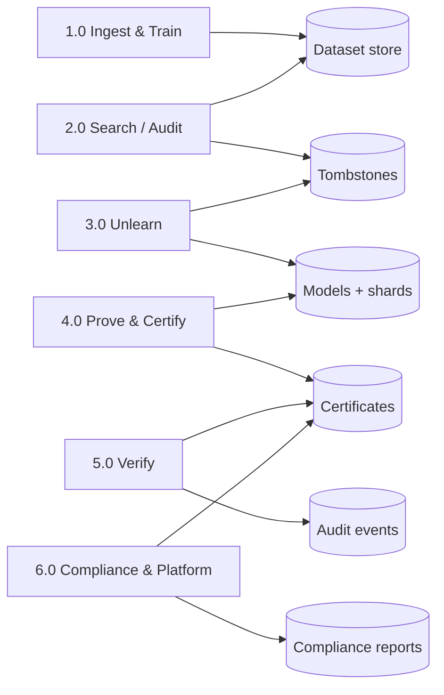

## 7. DFD Level 2 (Unlearning process 3.0)

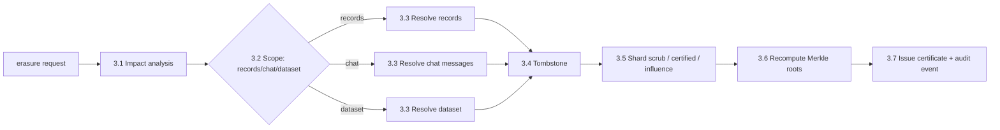

## 8. Use Case Diagram

```mermaid
flowchart TB
    Admin[Admin] Ops[Operator] Res[Researcher] Aud[Auditor] Viewer[Viewer] DP[Data Principal]
    subgraph Platform
        UC1[Search identities] UC2[Run unlearning] UC3[Verify certificates]
        UC4[Manage users/roles] UC5[Issue API keys] UC6[Run benchmark/attacks]
        UC7[View compliance] UC8[View monitoring] UC9[Export reports]
        UC10[View dashboards]
    end
    DP --> UC1
    Ops --> UC2
    Aud --> UC3
    Aud --> UC7
    Admin --> UC4
    Admin --> UC5
    Admin --> UC8
    Res --> UC6
    Res --> UC9
    Viewer --> UC10
```

## 9. Class Diagram (core services)

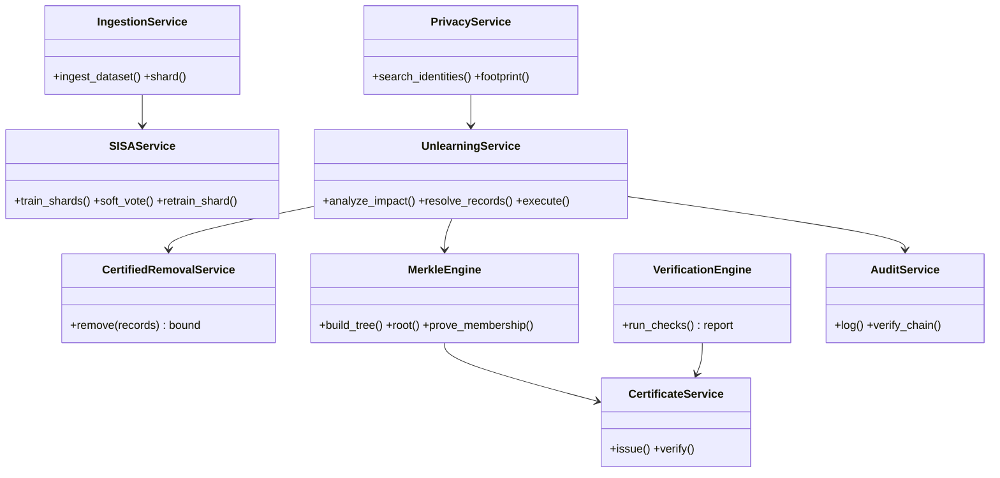

## 10. Sequence Diagram (erasure request)

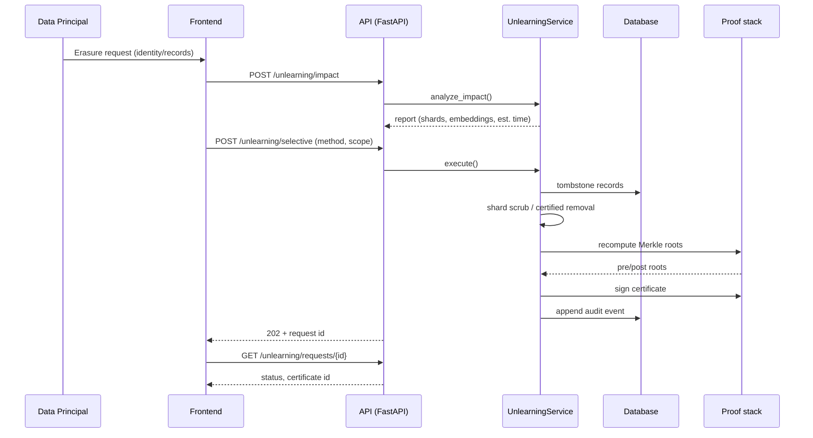

## 11. Activity Diagram (deletion pipeline)

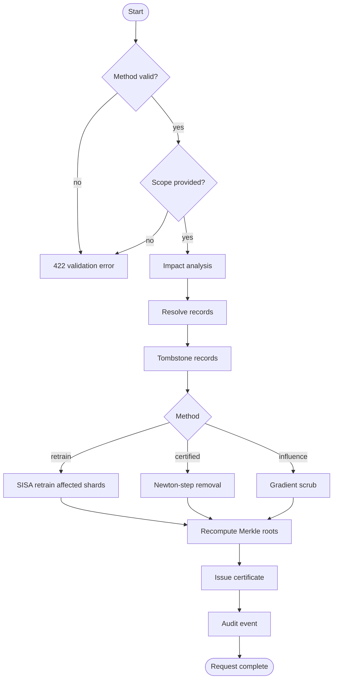

## 12. State Diagram (deletion request)

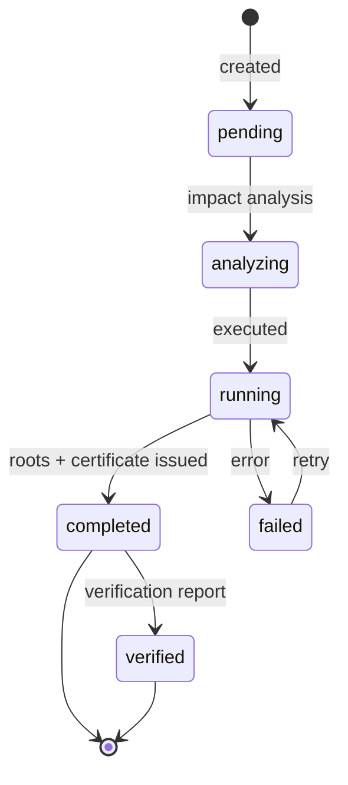

## 13. Deployment Diagram

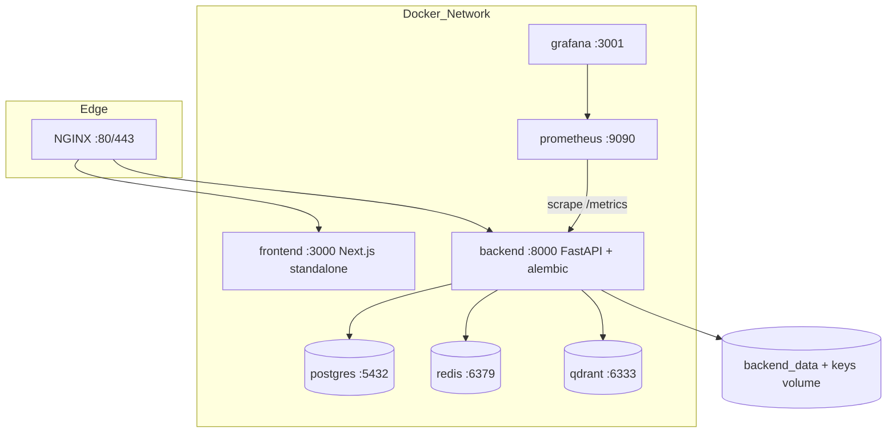

## 14. Component Diagram (verification flow)

```mermaid
flowchart LR
    subgraph VerificationEngine
        C1[records check] C2[embeddings check] C3[vectors check]
        C4[versions check] C5[merkle check] C6[signature check]
        C7[audit check] C8[consistency check]
    end
    DB[(DB)] --> C1 & C4 & C7
    VS[(Vector store)] --> C2 & C3
    CERT[certificate] --> C5 & C6
    VERDICT[Report: verdict + per-check results] --> EXPORT[PDF/JSON download]
    C1 & C2 & C3 & C4 & C5 & C6 & C7 & C8 --> VERDICT
```

## 15. Network Diagram

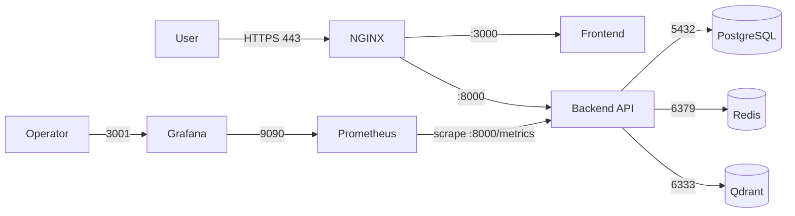

## 16. Workflow Diagram (compliance loop)

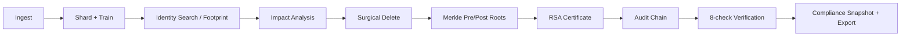

## 17. User Journey

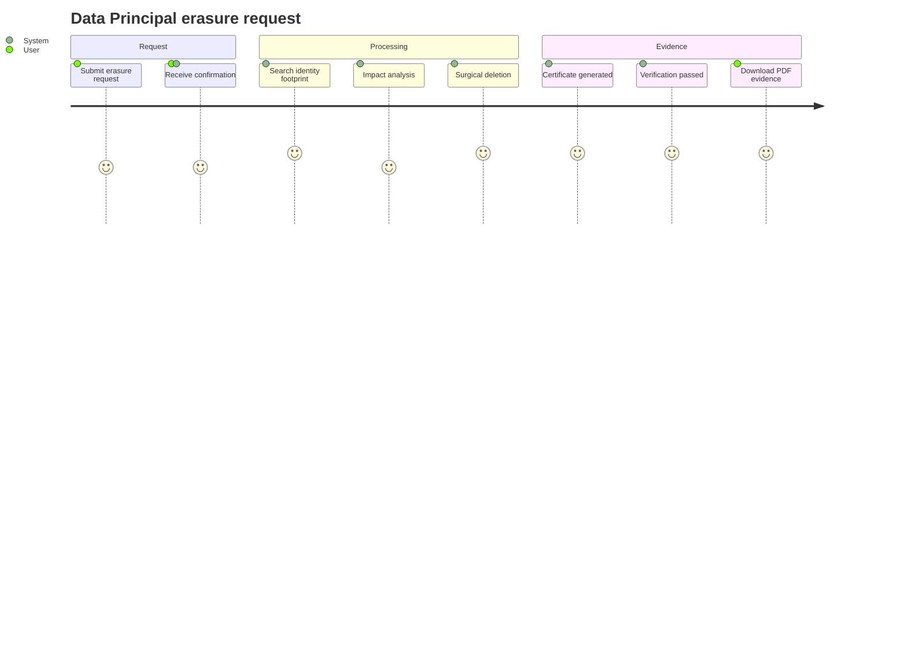
