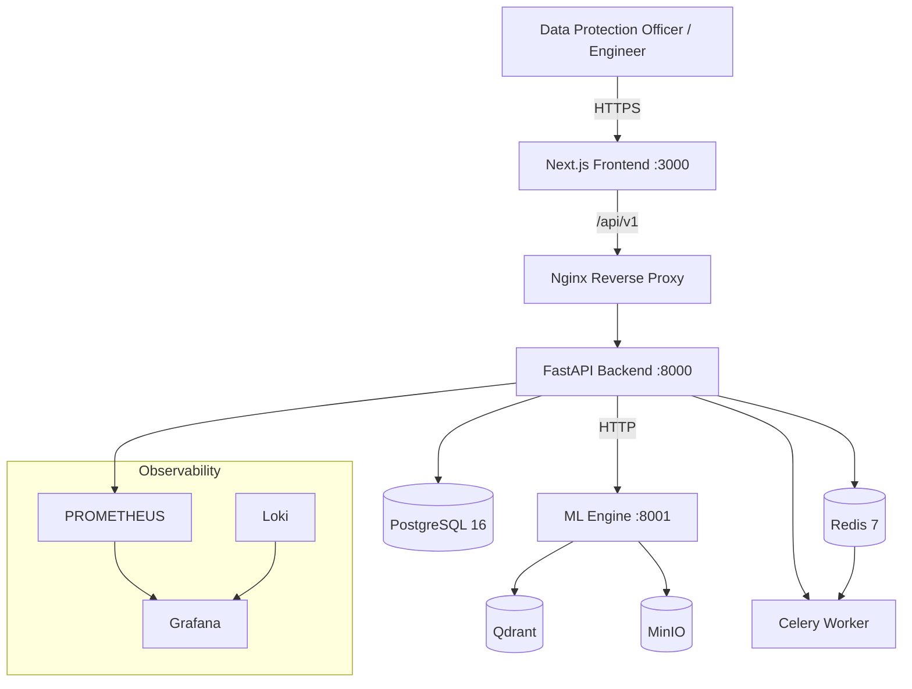
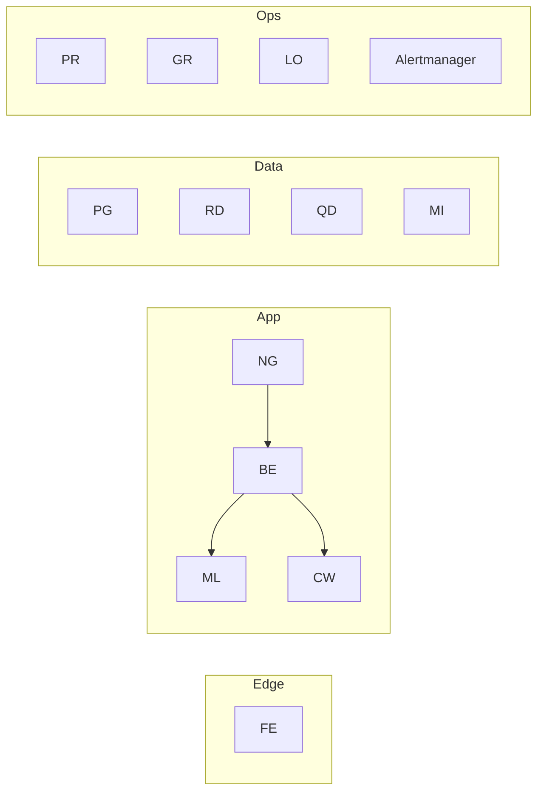
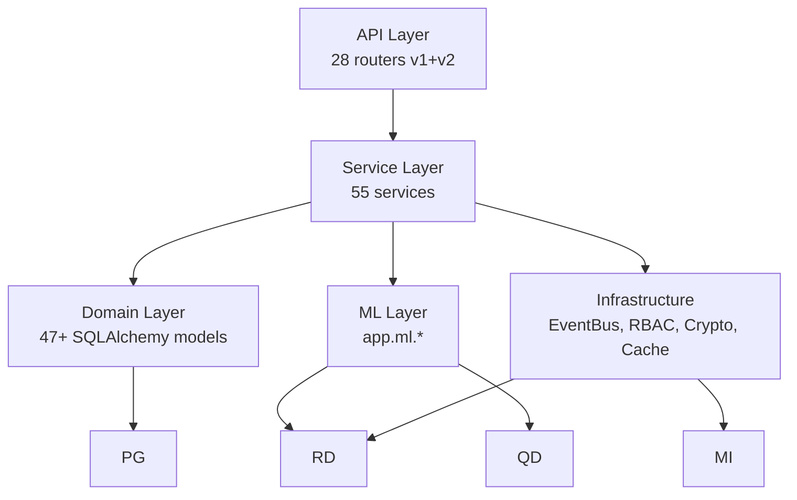
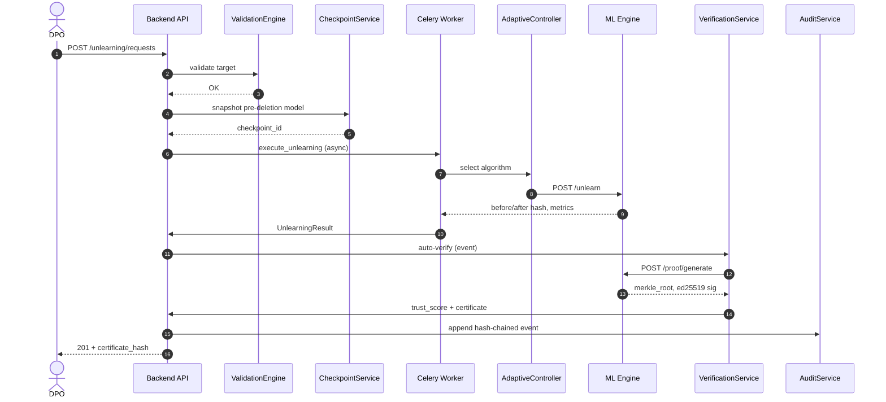
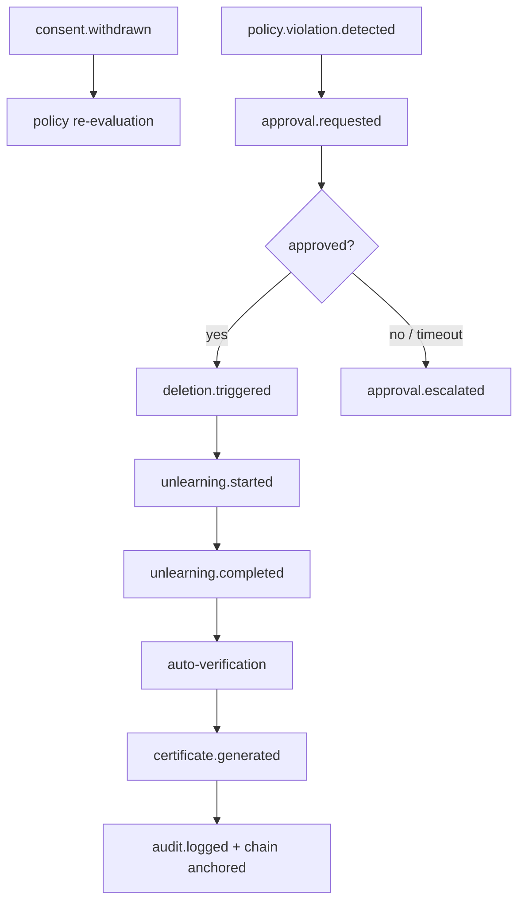
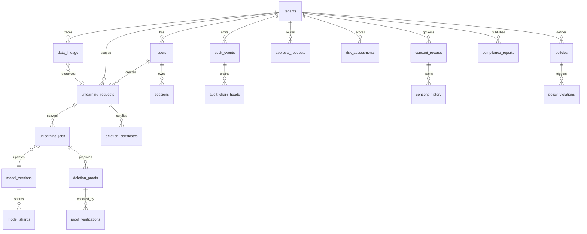
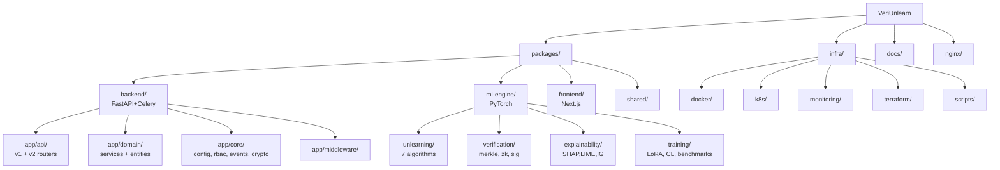

# VeriUnlearn — Architecture Diagrams

All diagrams use [Mermaid](https://mermaid.js.org/). They render on GitHub and in most
Markdown viewers. Companion prose: [architecture.md](architecture.md),
[database schema](architecture/02-database-schema.md).

---

## 1. System Context (C4 — Level 1)

---

## 2. Container / Deployment Topology

---

## 3. Layered Architecture

---

## 4. Unlearning + Verification Sequence

---

## 5. Event-Driven Governance Flow

---

## 6. Database ER Diagram (core unlearning + verification + governance)

> Full DDL (PostgreSQL, Redis, Qdrant, MinIO) is in
> [architecture/02-database-schema.md](architecture/02-database-schema.md).

---

## 7. Folder Structure

