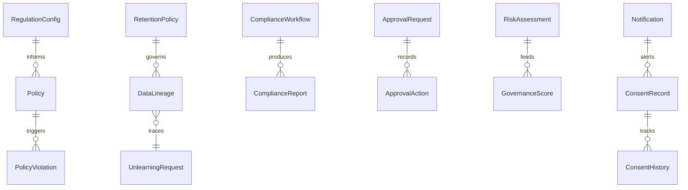

# Governance Guide

VeriUnlearn's governance layer connects unlearning to the *organizational* obligations that
motivate it: consent, policy, approval, risk, retention, and lineage.

---

## Governance Domain Model



Key entities (in `domain/governance` / `models`):

- **ConsentRecord / ConsentHistory** — immutable consent lifecycle (granted, withdrawn,
  expired, updated).
- **Policy / PolicyViolation / RegulationConfig** — configurable policy engine seeded with
  GDPR / CCPA / DPDP regulation templates.
- **ComplianceWorkflow / ComplianceReport** — orchestrated compliance processes and outputs.
- **ApprovalRequest / ApprovalAction** — multi-level approval with escalation.
- **RiskAssessment / GovernanceScore** — privacy, compliance, and exposure scoring.
- **RetentionPolicy / Notification / DataLineage** — retention enforcement, in-app alerts,
  and full traceability dataset→model→deletion→certificate.

---

## Event-Driven Governance

The `EventBus` wires governance automatically:

| Event | Auto-action |
|-------|-------------|
| `CONSENT_EXPIRED` | Policy re-evaluation |
| `POLICY_VIOLATION_DETECTED` | Create `ApprovalRequest` |
| `APPROVAL_GRANTED` | Trigger deletion (`deletion.triggered`) |
| `UNLEARNING_COMPLETED` | Auto-verification |
| `RISK_ASSESSED` | Update `GovernanceScore` |

---

## Consent Management

```http
GET  /api/v1/governance/consents
POST /api/v1/governance/consents     # grant
POST /api/v1/governance/consents/{id}/withdraw
```

Withdrawing consent can cascade to an unlearning request via the event bus.

---

## Policy Engine

```http
GET  /api/v1/governance/policies
POST /api/v1/governance/policies     # evaluate against dataset/model
```

Policies are data-driven; `RegulationConfig` holds per-region thresholds. The
`IntelligentPolicyEngine` (Phase 12, `app.future.intelligent_policy`) is the AI-assisted
future extension.

---

## Approvals

```http
GET  /api/v1/governance/approvals
POST /api/v1/governance/approvals     # create with escalation path
POST /api/v1/governance/approvals/{id}/approve
POST /api/v1/governance/approvals/{id}/reject
```

Approval chains escalate after a configurable timeout (`approval.escalated` event).

---

## Risk & Lineage

```http
GET /api/v1/governance/risk           # RiskAssessment + GovernanceScore
GET /api/v1/governance/lineage?target_id=...   # full traceability
```

`DataLineageService` connects a deletion request to its source dataset, model version,
unlearning job, and issued certificate — essential for audit defense.

---

## Notifications

`NotificationService` emits in-app notifications for governance events; each is recorded as
`notification.sent` and surfaced in the dashboard.

---

## Five Roles for Governance

| Role | Governance capabilities |
|------|-------------------------|
| `admin` | Full control |
| `compliance_officer` | Consent R/W, Policy R/W, Compliance approve, Retention R/W, Audit |
| `legal_team` | Consent R/W, Compliance approve, Lineage R |
| `auditor` | Read-only across unlearning, policy, compliance, lineage, audit |
| `viewer` | Read-only governance |

See [architecture.md](architecture.md#rbac-permission-model) for the full matrix.

---

## Assumptions

- Governance workflows are tenant-scoped; cross-tenant visibility is a Phase 10 feature.
- Policy enforcement is *advisory + loggable* by default; hard blocks require enabling the
  enforcement flag in `RegulationConfig`.
