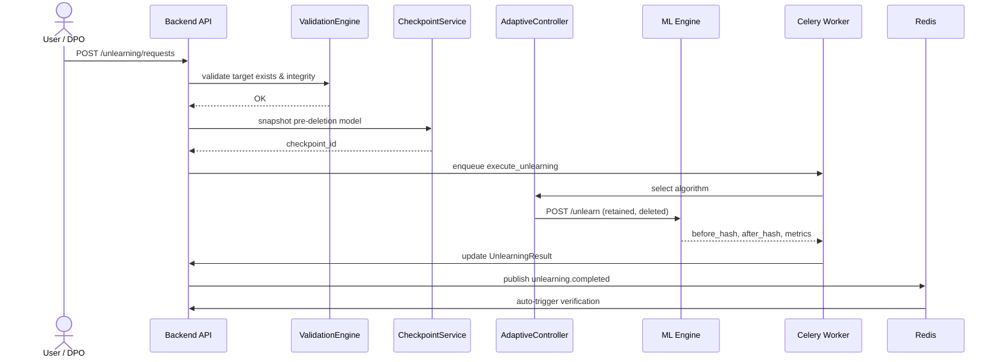

# Machine Unlearning Guide

This guide explains how VeriUnlearn removes the influence of specific training data
("forget set") from a model so that the resulting model is *approximately or exactly*
equivalent to a model that was never trained on that data — and produces cryptographic
evidence that the removal actually happened.

---

## Why Unlearning Matters

- **Regulatory "right to erasure"** (GDPR Art. 17, CCPA, India's DPDP Act 2023) requires
  that a user's data no longer influences automated decisions.
- **Model safety / harm reduction**: remove poisoned, copyrighted, or biased samples.
- **Reputational & legal risk**: retaining data you were asked to delete is a breach.

Naïvely deleting the row from a database does **not** remove its influence from the trained
weights. VeriUnlearn solves this with dedicated unlearning algorithms plus verification.

---

## Supported Algorithms

| Algorithm | Class | Guarantee | Cost | Best for |
|-----------|-------|-----------|------|----------|
| **SISA** | `SISAUnlearning` | Exact removal (retrain affected shard) | Medium | Large deletions / sharded models |
| **Influence Functions** | `InfluenceUnlearning` | Approximate (Newton step) | High | Medium deletions, fast turnaround |
| **Certified Removal** | `CerturedRemoval` | (ε,δ)-DP certified guarantee | High | Regulatory-critical, small deletions |
| **Bad Teacher** | `BadTeacherUnlearning` | Approximate (adversarial gradient ascent) | Medium | Targeted forgetting |
| **Catastrophic Forgetting** | `CatastrophicForgetting` | Approximate (weight perturbation) | Low | Lightweight forgetting |
| **ReLU Erasure** | `ReLUErasure` | Approximate (neuron de-activation) | Medium | Selective neuron forgetting |
| **Hybrid Adaptive Controller** | `AdaptiveController` | Adaptive | — | Automatic algorithm selection |

### Adaptive Controller policy

The `HybridAdaptiveController` automatically selects an algorithm from the deletion size:

| Deleted samples | Selected algorithm |
|-----------------|--------------------|
| 1 – 20 | Influence Functions |
| 20 – 500 | Hybrid (Influence + SISA) |
| > 500 | SISA |
| Any + `sensitive`/`regulated` flag | Certified Removal added |

You may also force a specific algorithm via the request payload.

---

## End-to-End Unlearning Pipeline



### Steps

1. **Validation** — `ValidationEngine` confirms the target (conversation, message,
   document, embedding, memory, user_data) exists and that the deletion is well-formed.
2. **Checkpoint** — `CheckpointService` stores a pre-deletion snapshot of the model
   (`Checkpoint` entity) for rollback.
3. **Algorithm selection** — `AdaptiveController.estimate_cost()` decides the algorithm,
   or a forced algorithm is used.
4. **Execution** — `UnlearningService` calls the ML engine (`POST /unlearn` or
   `/unlearn/e2e`). The engine returns before/after model hashes, adapter path, and metrics.
5. **Result persistence** — `UnlearningResult` records `model_updated`, MIA before/after,
   and utility retained.
6. **Verification (automatic)** — on `unlearning.completed` the event bus triggers
   `VerificationService` (see [Verification Guide](verification-guide.md)).
7. **Certificate + audit** — an Ed25519-signed deletion certificate is issued and every
   step is appended to the tamper-evident audit chain.

---

## Using the API

```http
POST /api/v1/unlearning/requests
Authorization: Bearer <token>
{
  "target_type": "document",
  "target_id": "9a8b7c6d-5e4f-4031-9a2b-1c0d9e8f7a6b",
  "gdpr_article": "17",
  "priority": "high"
}
```

Force an algorithm + watch the job:

```http
POST /api/v1/unlearning/requests
{ "target_type": "user_data", "target_id": "...", "algorithm": "sisa" }
```

```http
GET /api/v1/unlearning/jobs
GET /api/v1/unlearning/requests/{id}
POST /api/v1/unlearning/requests/{id}/retry   # on failure
```

---

## Rollback & Safety

- If verification fails or utility drops below threshold, the `Checkpoint` can be restored:
  `POST /adapters/{name}/rollback` restores the prior adapter version.
- `unlearning:lock:{job_id}` (Redis) prevents concurrent modification of the same model.
- Celery `execute_unlearning`, `generate_deletion_proof` tasks run against a worker-scoped
  DB session so jobs survive request/response boundaries.

---

## Assumptions & Limitations

- SISA requires the data to have been *sharded* at training time; for non-sharded models
  the controller falls back to Influence/Certified.
- Certified Removal injects (ε,δ)-DP noise (`σ = √n/τ · √(2·ln(1.25/δ))/ε`), trading some
  utility for a formal guarantee.
- Approximate methods reduce membership-inference attack success but do not offer a formal
  certified bound.
- Guarantees are over the *trained adapter*, not over logs, caches, or derived artifacts;
  pair with the [Compliance Guide](compliance-guide.md) for full erasure.
