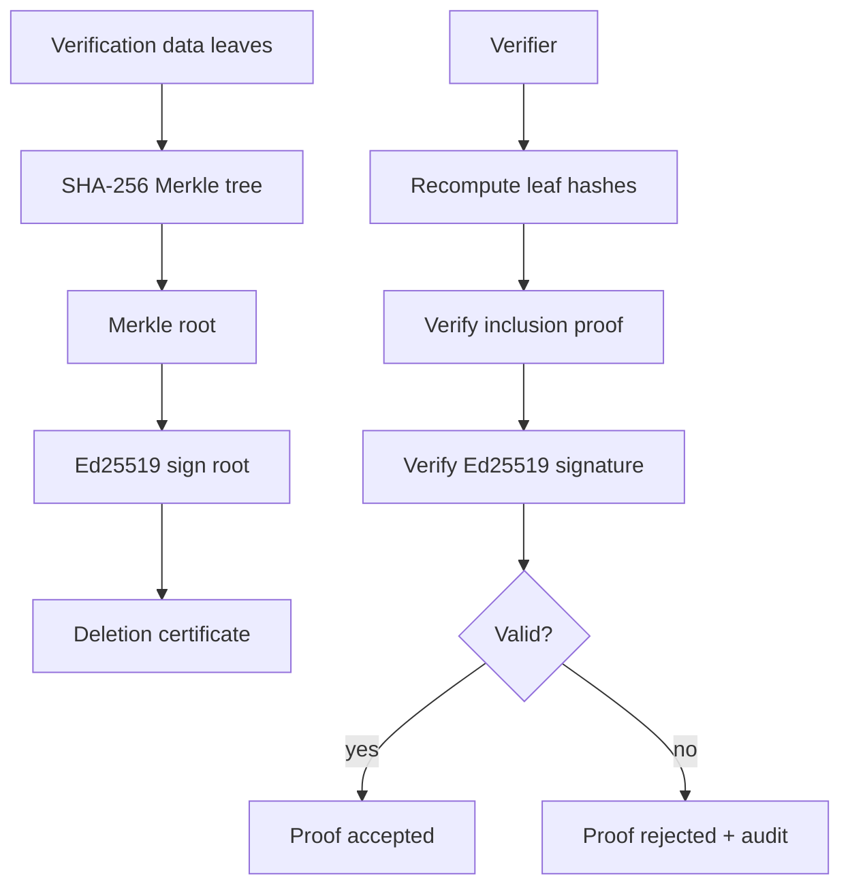

# Verification Guide

Verification is what makes VeriUnlearn *verifiable*. After unlearning, the platform proves
— with mathematics and cryptography — that the target data no longer influences the model.

---

## Verification Strategies

Five pluggable strategies implement `VerificationStrategy` and are run in sequence by
`VerificationService`. Each contributes to a weighted **trust score**.

| # | Strategy | Class | What it proves |
|---|----------|-------|----------------|
| 1 | Hash Verification | `HashVerificationStrategy` | SHA-256 artifact fingerprints changed as expected |
| 2 | Merkle Verification | `MerkleVerificationStrategy` | Batch inclusion proof over verification data |
| 3 | Influence Verification | `InfluenceVerificationStrategy` | Influence-function deletion confirmed |
| 4 | Membership Inference | `MembershipInferenceStrategy` | MIA success drops below threshold before→after |
| 5 | Forget Quality | `ForgetQualityStrategy` | Utility retained above minimum acceptable level |

`VerificationRegistry` allows registering custom strategies (see Plugin SDK).

---

## Cryptographic Primitives

| Primitive | Algorithm | Library | Use |
|-----------|-----------|---------|-----|
| Digital signatures | Ed25519 | PyNaCl (`nacl`) | Sign certificates & proof artifacts |
| Hashing | SHA-256 | `hashlib` | Artifact fingerprinting, audit chain |
| Merkle trees | SHA-256 | `app.crypto.merkle` | Batch inclusion proofs |
| API-key hashing | SHA-384 | `hashlib` | Secure key storage (`vu_` prefix) |
| zk-SNARKs | Keccak-256 + Groth16-style | `ZKProofService` | Zero-knowledge Merkle inclusion |

### Merkle verification flow



### zk-SNARK proofs

`ZKProofService.generate_zksnark_proof()` wraps a Keccak-256 Merkle inclusion proof in a
Groth16-style envelope (`proving_key`, `verification_key`, π_A/π_B/π_C points, Ed25519-signed
root). **Zero-knowledge property**: the verifier learns the leaf and root but *not* the leaf
index or the other leaves. Routes:

```http
POST /api/v1/verify/zksnark/generate
POST /api/v1/verify/zksnark/verify
```
(Proxied to ML engine `/proof/generate-zksnark`, `/proof/verify-zksnark`.)

---

## Trust Score

`TrustScoreService` aggregates the five strategy outputs into a single `trust_score`
(0–1, weighted). The score, together with the certificate and audit chain, is returned by:

```http
POST /api/v1/verify/proofs/generate
POST /api/v1/verify/certificates/generate
```

The deletion certificate is X.509-style, carries the Merkle root, Ed25519 signature, and a
QR code for offline verification.

---

## Verification via API

```http
POST /api/v1/verify/proofs/generate
{ "request_id": "c1d2e3f4-5678-90ab-cdef-1234567890ab" }
```

Response includes `merkle_root`, `signature_hex`, `certificate_hash`, and `verified: true`.

Re-verify an existing proof at any time:

```http
POST /api/v1/verify/proofs/verify
{ "proof_id": "d4e5f6a7-b8c9-0d1e-2f3a-4b5c6d7e8f90" }
```

Each verification is logged in `proof_verifications` (method: `api`, `cli`, `blockchain`,
`manual`) and appended to the audit chain.

---

## Blockchain Anchoring

`BlockchainAnchoringService.anchor_chain()` computes a Merkle root over the audit chain and
anchors it via `SimulatedBlockchain`. A Celery beat task (`audit.anchor_chains`) runs every
6 hours. Endpoint: `POST /audit/chain/anchor`.

---

## Assumptions & Limitations

- Ed25519 + SHA-256 give strong, but *not* post-quantum, guarantees.
- The zk-SNARK service is a Groth16-*style* prototype (not a production trusted setup);
  see [ADR-012](adr/0012-zero-knowledge-proofs.md).
- Trust score weights are heuristic; tune them per regulatory context.
- Blockchain anchoring uses a simulated ledger by default; wire a real chain via
  `app.future.blockchain.providers`.
